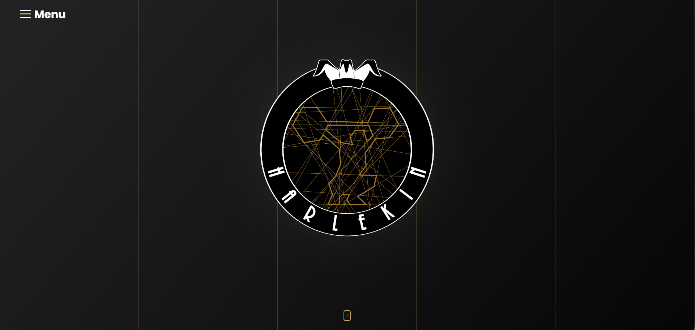

# My First Web Project



This is one of my first web projects, primarily built using standard JavaScript, HTML, and SCSS. The project focuses on creating a visually appealing and interactive webpage with minimal JavaScript functionality to enhance user experience.

## Live Demo

You can check out the live version of the project here: [Live Demo on Vercel](https://harlekin-home-page.vercel.app/)

## Features

- Responsive design using **SCSS**
- Interactive elements powered by **Vanilla JavaScript**
- Animations and transitions for a smooth user experience
- Google Maps integration for location display
- Contact buttons that open default email client pre-filled with subject and body

## Technologies Used

- **HTML5** for structure
- **SCSS** for styling
- **Vanilla JavaScript** for interactive features
- **Vercel** for deployment

## Installation

To run this project locally, you can clone the repository and open the `index.html` file in any browser.

```bash
git clone https://github.com/yourusername/yourproject.git
```
